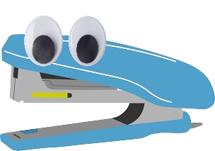

# Stapler-y: The modern version of Clippy

Stapler-y is a small desktop pet that walks around your screen, responds to simple commands, and uses a chat interface backed by a local AI.

Features
- Interactive desktop pet with animations (walk, run, jump, sit, sleep, explode/respawn).
- Chat with the pet (history persisted to `brain/history.json`).
- Clear chat history from the chat UI.
- Screen viewer and screenshot capture (multi-monitor aware via `mss`).
- AI can "see" the screen (screenshot passed to AI) and can issue commands to control the pet.

Quick start
1. Create and activate a Python 3.10+ virtualenv (recommended):

```powershell
python -m venv .venv
.\.venv\Scripts\Activate.ps1
```

2. Install dependencies:

```powershell
pip install -r requirements.txt
```

3. (Optional) Install Tesseract OCR for Windows if you want OCR in chat:
- Download & install from https://github.com/tesseract-ocr/tesseract
- Ensure the `tesseract` binary is on your PATH.

4. Run the app:

```powershell
python main.py
```

Using the UI
- Right-click the pet to open the context menu. Use "💬 Chat with Me!" to open the chat window.
- In the chat you can send messages to the AI. Chat history is saved to `brain/history.json`.
- Use the "Clear" button in the chat input area to clear history.
- In the pet menu choose "👀 View Screen" to open a screen viewer; press Refresh to re-capture.

AI command formats (how the AI can control the pet)
- JSON command (preferred for structure):

```json
{"command":"jump"}
```

- Line-based commands:

```
COMMAND: jump
/run
/move_to x=200 y=300
```

Supported commands
- `walk`, `run`, `jump`, `sit`, `eat`, `pet`, `sleep`, `respawn`, `quit`/`exit`
- `set_state state=<state>` — set arbitrary pet state
- `move_to x=<num> y=<num>` — move pet to coordinates
- `clear_history` — clear chat history file and UI
- `view_screen` — open the screen viewer
- `save_screenshot` — save current screenshot to `brain/`
- `say text=<message>` — post a chat message as the pet

How it works (high level)
- `desktop_pet.py` controls the UI, animations, and interactions.
- `ai.py` exposes `get_response(prompt, screen_image=None)`; if a screenshot is provided it will attempt OCR via pytesseract (if installed) and include extracted text in the prompt.
- `desktop_pet` captures the screen with `mss` (fallback to Pillow's ImageGrab) and passes the image to `ai.get_response`.
- If the AI returns a command (JSON or command lines), `desktop_pet` will parse and execute it and post a `System` result back to chat.

Security & safety
- Commands are executed locally and may perform actions like quitting the app or moving the pet. If you want stricter controls, add a confirmation prompt or a whitelist for allowed commands.

Development notes
- Tests: none included yet. A follow-up task can add simple unit tests and a run script.
- Packaging: this is a light prototype; consider packaging with PyInstaller for distribution.

Files of interest
- `desktop_pet.py` — main UI & logic
- `ai.py` — AI wrapper and integration (fallback responses are hardcoded in this file)
- `brain/history.json` — persisted chat history

Examples
--------

1) Quick AI command test (JSON): have the AI respond with this exact JSON in chat to make the pet jump:

```json
{"command": "jump"}
```

2) Line-command example: the AI can reply with a line like:

```
COMMAND: move_to x=300 y=200
```

3) Slash-style example:

```
/save_screenshot
```

These formats are parsed automatically by `desktop_pet` and executed. Execution results are posted back as `System` messages.

Troubleshooting
---------------

- Screen capture returns blank or errors:
	- Ensure `mss` is installed (`pip install mss`). `mss` is the preferred backend and handles multi-monitor setups.
	- If `mss` is not available, Pillow's `ImageGrab` is used; on some Linux setups ImageGrab requires an X server.

- OCR (text from screen) not appearing or empty:
	- Install `pytesseract` and the Tesseract binary. On Windows, install the official Tesseract installer and add the installation folder to your PATH.
	- Verify `pytesseract.image_to_string()` works in a Python REPL.

- Chat history not saving:
	- Check that `brain/history.json` exists and is writable. The app creates it on first save.

- App fails to start or throws import errors:
	- Run `pip install -r requirements.txt` to install listed dependencies.

Testing AI command flow
-----------------------

1. Run the app: `python main.py`.
2. Open the chat (`Right-click → Chat with Me!`).
3. Paste a JSON command like `{"command":"jump"}` into the chat input and send it. The pet should perform the action and you should see a `System` message confirming execution.
